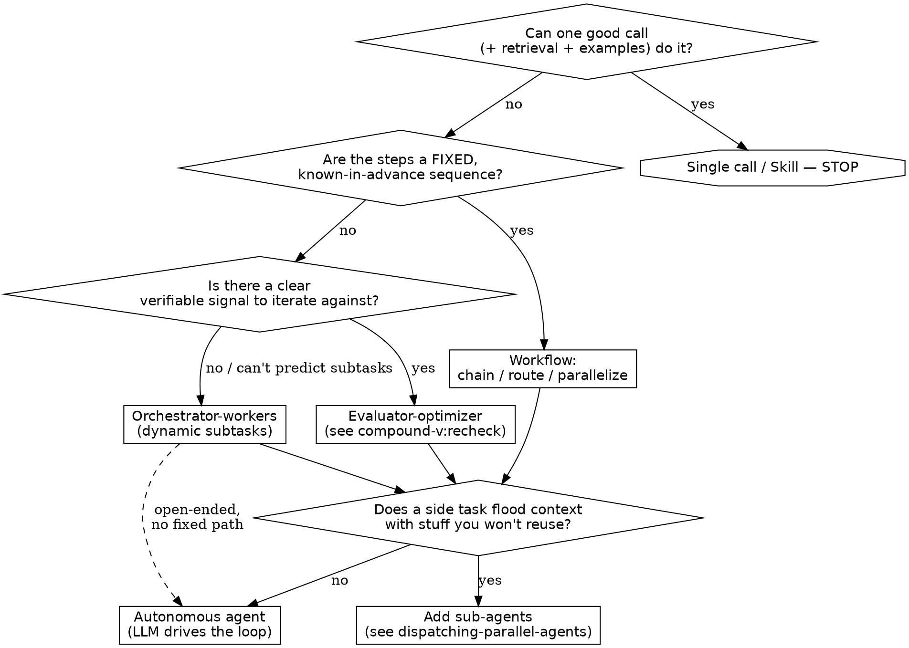

# Designing Agents

Find the simplest thing that works, then add agentic complexity **only when it demonstrably improves outcomes**. Every step up the ladder trades latency and cost for capability — so each rung has to pay for that tax. For many features, a single LLM call with good retrieval and a few in-context examples is already enough; reach higher only when a fixed call can't express the task.

Two definitions to keep straight, because the whole decision turns on them:
- **Workflow** — LLMs and tools orchestrated through *predefined code paths*. You wrote the control flow; the model fills in the steps.
- **Agent** — the LLM *dynamically directs its own process and tool use*. The model drives the loop and decides what to do next.

Workflows are predictable and debuggable; agents handle the unpredictable at the cost of predictability. Most "I need an agent" turns out to be "I need a workflow," and most "I need a workflow" turns out to be one good call.

## When to use

- You're deciding the *shape* of an AI feature: one call vs. a chain vs. a loop vs. multiple agents.
- Someone said "let's make this an agent" and you're not sure it needs to be.
- You're adding a multi-step LLM feature, a pipeline, or tool use and choosing how much structure.
- An existing LLM feature is flaky, slow, or expensive and you suspect it's over-built (or under-built).
- Skip it when the shape is obvious — a single, well-understood call needs no architecture decision; just write it.

This skill owns the **decision** — which shape, how much complexity. It does not own execution: for token/context mechanics use compound-v:context-engineering; for the fan-out details once you've chosen to parallelize use compound-v:dispatching-parallel-agents; for the evaluator/review loop use compound-v:recheck.

## The escalation ladder — climb only as far as the task forces you

Start at the bottom. Move up one rung only when you can name the specific thing the current rung *can't* do.

1. **Single augmented-LLM call** — one model call with retrieval, tools, and in-context examples. The atomic building block; everything above is composed from it. Default here.
2. **A Skill** — a reusable prompt/procedure that runs *in the main context*. The cheapest reuse there is: no isolation tax, no extra round-trips. If the win is "I keep re-explaining the same thing," it's a Skill, not an agent.
3. **A workflow (predefined control flow)** — when the task cleanly decomposes into *fixed* steps you can write in code. Three canonical shapes:
   - **Prompt chaining** — sequential steps, each consuming the last's output; add a programmatic gate between steps to catch errors early. Use when the decomposition is fixed and clean (outline → validate → write).
   - **Routing** — classify the input, dispatch to a specialized handler. Use when inputs fall into distinct categories better handled separately; doubles as a cost lever (send easy cases to a small model, hard ones to a big one).
   - **Parallelization** — *sectioning* (independent subtasks at once) or *voting* (same task N times for confidence). Use for speed or when multiple perspectives raise reliability.
4. **Orchestrator-workers** — a lead LLM decides the subtasks *at runtime* and delegates them. The distinction from parallelization: the subtasks **aren't known in advance**. Use only when you genuinely can't predict the decomposition (multi-file edits, open-ended search).
5. **Evaluator-optimizer** — a generator and an evaluator loop until a signal says "good enough." Use only when you have a *clear evaluation criterion* and iterative refinement measurably helps — i.e. there's real signal that feedback improves the result, like a reviewer would give.
6. **Autonomous agent** — the model plans and operates the loop itself on environmental feedback, for as many steps as it takes. Use for open-ended problems where you *can't* hardcode a fixed path or predict the step count. Precondition: the agent can get **ground truth from the environment each step** (test results, code execution, tool returns) — without that grounding it drifts.
7. **Sub-agents (context isolation)** — split work into fresh, isolated context windows. The real reason is **context control**, not role-play "my PM / my QA": a sub-agent does token-heavy reading/searching and returns only a distilled answer, keeping the parent clean. But it starts clean-slate (sees none of your history) and pays a latency tax to re-gather context, plus a "telephone" risk on what it returns — so don't reach for it when the task needs tight back-and-forth or shares a lot of context with the main thread.

## An agent is an LLM + a loop + tools — there is no secret

A working coding agent is **under ~400 lines, most of it boilerplate** (~190 after three tools). The loop is the whole heartbeat: read input → append to the conversation → call the model with the full conversation + tool defs → if the model returns a tool call, run it and append the result → if it returns text, show the user → loop. The model server is *stateless*; it only sees what you put in the `conversation` — maintaining that history is your job, which is why context engineering is the substance of agent quality.

A tool is four parts: **name**, **description** (what it does, when to use it, when not, what it returns — written like a docstring for a new hire), **input schema**, and the **function**. Give a model a tool and it *wants* to use it — it auto-triggers and chains without coaching. So the leverage is in the tool interface, not clever prompting: builders routinely spend more time optimizing tools than the prompt. Make wrong calls hard to express at the interface (see compound-v:searching-patterns for the tool-interface / ACI details — poka-yoke args, absolute paths, minimal non-overlapping set).

**Skip the high-level agent SDKs.** Model differences are large enough that you'll end up building your own thin abstraction anyway, and the SDKs obscure the underlying prompts/responses and can mangle message history. Target the provider API directly so you control cache points and see real errors.

## Per-step reliability is the real bottleneck

Multi-step agents fail on *compounding* error, not on any single hard step. At 90% per step, 100 steps gives 0.9^100 ≈ 0.003% — effectively zero. You need roughly **99.9% per step** before long chains work, and each added "nine" is roughly an order-of-magnitude harder. This is *the* reason to favor less structure: fewer steps means fewer places to fail.

Two design consequences:
- **Scope tasks small and verify each one.** A short chain of well-verified steps beats a long autonomous run you can't check. Prefer subtasks that have **automated verification** (tests, type-checks, a runnable result) — verifiability, not model IQ, is what limits how far an agent can reliably go.
- **Don't trust the model's own narration as a check.** "Show your reasoning" is not a correctness signal — the visible chain-of-thought can be edited to nonsense and the model still answers correctly, so it isn't a faithful trace of the computation. Ground your verification in tooling, not in the model grading itself.

## Keep tools dumb; reinforce the objective every turn

- **Tools should be deterministic, not agentic.** An "agentic tool" (a sub-agent dressed as a tool) is hard to reason about and compounds failures across two non-deterministic systems. Make "search the web" a plain search, "check the knowledge base" a plain lookup — don't ask an LLM to please do the deterministic thing. Consolidate tools to a minimal non-overlapping set; the litmus test is **if a human engineer can't say which tool to use in a situation, the model can't either.**
- **Reinforce the objective on every tool return**, not once up front. Each tool result is a chance to re-state the goal and current status, hint when a tool failed, and report state changes. A todo/echo tool that just reflects the agent's own task list back is enough to keep it on track — that's most of what it does.
- **Manage cache points explicitly** (this is where agent cost lives — see compound-v:context-engineering). Keep the system prompt and tool list static so the prefix stays cached; feed dynamic data (current time, fresh state) in a *later* message, never in the cached prefix.

## Worked example — "add an AI feature that answers questions about our docs"

The reflex is "build a RAG agent with sub-agents." Walk the ladder instead:

1. **Single call?** Paste the relevant doc section + the question into one call with a grounding instruction ("answer only from the provided context"). If the docs fit and retrieval is trivial, *you are done* — ship this.
2. **Retrieval too big to paste?** Add a retrieval step → a two-call **chain** (retrieve → answer). Still a workflow, still debuggable. Most "doc Q&A" lives here.
3. **Questions span unrelated domains?** Add **routing** (billing questions → billing docs + a billing-tuned prompt; API questions → API docs). A classifier in front, specialized handlers behind.
4. **Questions need multi-hop research across many sources you can't predict?** *Now* it's **orchestrator-workers**: a lead decides which sources to pull and dispatches readers. Each reader is a **sub-agent** so its raw page dumps never pollute the lead's context — only findings return.
5. **Answers need to meet a quality bar?** Wrap an **evaluator-optimizer** loop (compound-v:recheck) that checks groundedness and retries.

Each rung was added only because the previous one *couldn't* express the requirement. Stop the moment the task is satisfied — every rung you didn't need is latency and cost you didn't pay.

## Red flags

| Symptom | The actual problem |
| --- | --- |
| "Let's make it multi-agent" before a single call was tried | Skipping the ladder. Burden of proof is on complexity — prove the call fails first. |
| Sub-agents named after job titles ("PM agent", "QA agent") | Role-play, not context control. Split for *context isolation*, not org-chart cosplay. |
| Long autonomous loop with no verification between steps | 0.9^n is killing you. Scope smaller, verify each step against ground truth. |
| A tool that is itself an LLM agent | Compounding non-determinism. Make the tool deterministic; lift the intelligence to the loop. |
| Reaching for a heavyweight agent framework on day one | It hides the prompts and mangles history. Drive the loop yourself. |
| Dynamic data (timestamps, state) in the system prompt | Busts the cache every turn. Static prefix; feed dynamics in a later message. |
| "Show your reasoning" used as the correctness check | CoT isn't a faithful trace. Verify with tools, not self-narration. |
