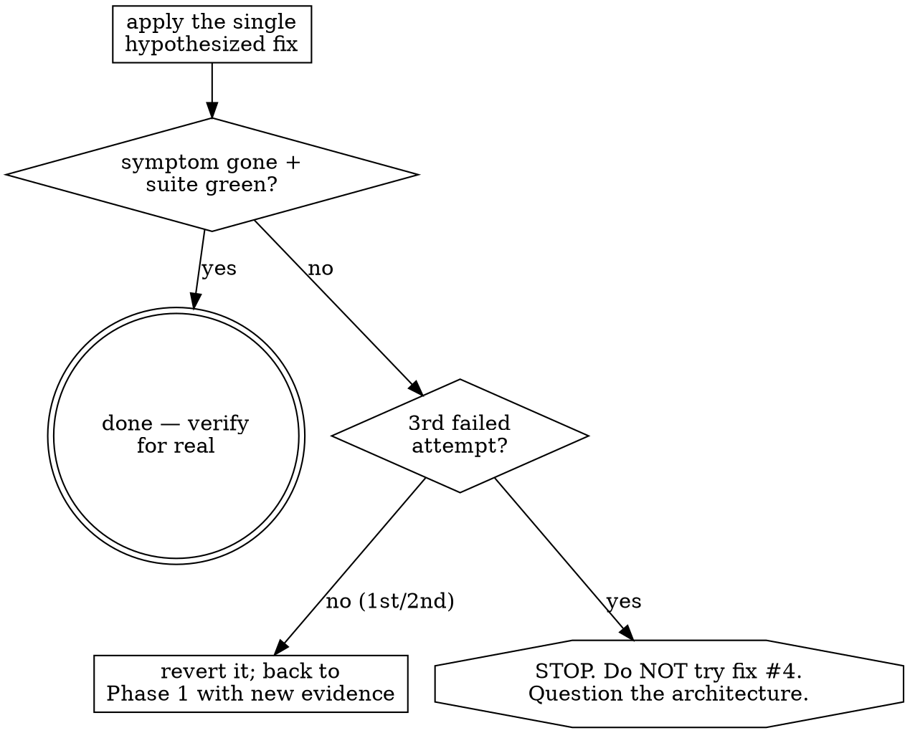

# Systematic Debugging

Find the root cause before you touch a fix. A fix aimed at a symptom you don't understand either misses, or papers over the real defect and spawns two more.

The failure mode this prevents: pattern-matching the error to a plausible-looking change, applying it, and — when it doesn't work — applying another, and another. Each blind attempt mutates the code, muddies the evidence, and moves you further from the cause. One understood fix beats five guesses.

## When to use

- Any bug, test failure, crash, hang, or "it works on my machine but not in CI."
- Output that's wrong in a way you can't immediately explain.
- Before proposing a fix — if you're about to say "try changing X," stop and confirm you know *why* X is the cause.

For a one-line obvious typo (wrong variable name the compiler points at), just fix it. This skill is for anything where the cause isn't already staring at you.

## The four phases — in order

You don't always need all four, but you may not skip *ahead* of a phase you haven't satisfied. You cannot hypothesize a cause (Phase 3) before you've reproduced and traced (Phase 1).

### Phase 1 — Find the root cause
- **Read the code before you hypothesize — and expect that to feel expensive.** The pull is always toward firing off one cheap hypothesis immediately instead of spending tokens reading; the felt experience is urgency, as if the budget will run out mid-task. It won't. Reading the relevant code first can legitimately consume a large fraction of a session's tokens and still be the fastest path to the fix — five guesses cost more, in tokens and in damage. Naming the bias is what lets you override it.
- **Read the actual error.** The full message, the full stack trace, the exit code. Not the gist — the literal text. The answer is often in a line people skip.
- **A green you can't explain is a defect, not a pass.** AI/agent code fails silently — the loop exits 0 with a confidently-wrong answer and no error ever fires, so a passing-looking result you cannot account for is a bug *lead*, not a finish. Go simple-to-complex and never trust an output you can't explain; distrust the passing signal, don't just chase visible crashes.
- **Reproduce it consistently.** A bug you can't trigger on demand, you can't verify you fixed. Find the exact inputs/steps. If it's flaky, make it deterministic before going further (e.g. control the timing/seed/ordering that makes it intermittent). For a nondeterministic agent/LLM there is no single reproducible stack trace — a bug that fires 1-in-5 runs defeats both "reproduce on demand" and "write one failing test." Build a small graded example set (**compound-v:evals**) and treat *where it fails across runs* as your repro and your regression guard — the same role a failing test plays for deterministic code. (No eval system is the #1 reason AI products fail.)
- **Shrink to the simplest failing case.** Strip the input down to the smallest instance that still fails — and check the system passes the *single simplest* instance (one item, empty list, one request) before you debug the broad case. If the simplest case already fails, the bug is upstream of everything you were looking at; debug *that* first.
- **Check what recently changed — `git` is not the whole ledger.** `git diff`, `git log` on the touched files; most new bugs entered with recent edits. But at real ship frequency most of what reaches production is not a commit: one 18,000-engineer estate's ~30,000 daily production changes are PRs, config changes and database updates alike, some fired automatically. A clean `git log` is therefore not evidence that nothing changed — before concluding "no recent change," enumerate the non-code surfaces too: flag/config history, deploy log, migration log, dependency resolution. And `git bisect` (ideally `git bisect run <failing-test>`) pins the introducing commit *only when the cause is in the history*. State borne outside it — a flipped flag, a rotated secret, an env var, a schema migration, a floating dependency that re-resolved — is live at every commit bisect tests, so every build comes back bad and it silently names the oldest commit in the range. Confirm the failure is absent at your known-good commit before spending a bisect; an all-bad bisect means the cause is outside the commits, not a verdict on the one it names.
- **Trace backward from the symptom to its source.** Don't fix where the error *surfaces*; follow the data back to where it first goes wrong. In a multi-component flow, log (or inspect) the value at each boundary between components — the boundary where good input becomes bad output is your suspect. The error message location is a clue, not usually the cause.
- **For a wrong AI answer, localize retrieval vs prompt.** Read the raw context the model actually received, not the rendered output. If *you* can't derive the right answer from that context, the bug is retrieval, not the prompt — force the model to answer only from what's provided to prove which half is at fault.

### Phase 2 — Find a working reference
- If something *similar* works elsewhere in the codebase, compare against it **completely** — every difference, not the first one you spot. The bug is usually in a difference you dismissed as irrelevant.
- Make sure you understand the dependency/API you're using — read its real contract, don't assume its behavior.
- **Diagnose before mutating the environment.** When the failure looks like deps/build/env, do NOT reflexively install, uninstall, upgrade, or `rm -rf node_modules` first. Read the error, inspect the lockfile/config, understand *what's actually missing* — then act. Thrashing the environment destroys the evidence and often "fixes" it by accident, so you never learn the cause and it returns.

### Phase 3 — Form a single hypothesis
- State it explicitly: **"X is the root cause, because Y."** Writing it forces the causal claim into the open where you can check it.
- **One hypothesis, one variable at a time.** Changing three things at once and seeing it pass tells you nothing about which mattered — and one of the other two may now be a latent bug.
- If you genuinely don't know, say "I don't know" and go gather more evidence. A confident wrong hypothesis is worse than an admitted gap.
- **If you can't state what "correct" would even look like, the bug is underspecification, not a code defect.** Pin the expected behavior down first — otherwise you chase a symptom that keeps shifting as your notion of "right" drifts (*criteria drift*).

### Phase 4 — Fix and verify
- **Write a failing test that reproduces the bug first**, then fix until it passes (this is the bug-fix loop in **compound-v:test-driven-development**). The test is your proof the fix landed and your guard against regression.
- Make the **single** change your hypothesis predicts. Verify the symptom is gone and the suite stays green.
- If the fix doesn't work, that hypothesis was wrong. Revert it (don't leave failed attempts stacked in the code), return to Phase 1 with what you just learned, and count the attempt. Revert the *code*, but keep the failure in *context* — the failed action and its literal error text are what move you off that entire class of attempt, so don't tidy them out of the working notes or summarize them away. The instinct to clean up is exactly what makes a model re-issue the call that just failed.

## The 3-attempt rule — stop digging, question the design

Track your fix attempts. The empirical cap before escalating is **three** — production coding agents converge on it independently — across CI-failure loops, lint-fix loops, and retry caps. This is the canonical home of the 3-attempt rule; **compound-v:recheck** and **compound-v:batched-implementation** cross-ref here for their fix↔recheck cap rather than restating it.

**Decide what counts as the same attempt, or the cap never fires.** Two failure shapes need two reads. *Identical error text to the last attempt* — you changed nothing that mattered: stop at **two**, not three, because a third pass over an unchanged failure is the shape that eats whole runs (one production coding agent lost ~20 of 89 benchmark tasks to exactly this, circling on the same error). *A different error every round* — not progress, whack-a-mole; it slips a cap anchored on "the same failure keeps happening" precisely because the failure never repeats, so count those attempts too: a fresh symptom each round is itself the evidence that your model of the system is wrong. And the count does not reset because you re-described the problem — strip the per-run noise (temp paths, timestamps, run ids) before deciding whether two failures are the same one.

Classify the failure before you spend a retry. A **deterministic** red — validation error, missing/typed arg, auth revoked, type error — is guaranteed to fail again on the same inputs: **zero retries**, go straight to root cause or ask. Reserve the retry budget for genuinely **transient** faults (network blip, 503, rate limit). The retry-cap is for non-determinism, not for hoping a deterministic bug disappears — and a try/except-retry around a deterministic red is just that anti-pattern wearing a loop. (Standard transient-fault practice: retry only faults expected to be short-lived; never retry one guaranteed to recur.)

Name which degradation state you're actually in before you spend another attempt — **frozen / stuck / blocked / misdirected**, defined in **compound-v:designing-agents**; one word for all four gets you the wrong response. One rider is debugging-specific: **blocked** is not declarable on the first obstacle (a credential you don't hold, a service that's down). Require the **same** blocking condition across at least three consecutive attempts — one failure is noise, three is a signal — then escalate with the exact condition named.

After three failed fixes, the problem is almost never the next tweak — your model of the system is wrong. **Do not attempt fix #4.** Stop and challenge a level-up assumption:

- Is my understanding of how this system works actually correct? (Re-read, re-trace — maybe the data doesn't flow the way I assumed.)
- Is the *design* the bug, or am I fixing the wrong layer? A fix that keeps slipping away usually means the abstraction is wrong rather than the line — and the symptom may be downstream of a cause in a component I never opened.
- Should I ask the user / surface the blocker? "I've tried A, B, C, each failed because Z — I think the issue is the design of W" is far more useful than a fourth guess.

## Red flags

| Thought / behavior | What to do instead |
| --- | --- |
| "Let me just try changing this and see." | You're guessing. Reproduce and trace to the cause first (Phase 1). |
| "I'll reinstall deps / bump the version and hope." | Diagnose before mutating the environment — read the error and the lockfile first (Phase 2). |
| Wrapping the symptom in a try/except, a defensive check, or a retry to make it pass | Concealment, not a fix — and a signal you crossed the 3-attempt line a while ago. Find why it throws. |
