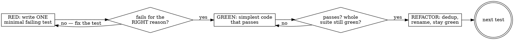

# Test-Driven Development

Write the test first. The failing test is the spec; the implementation exists only to turn it green.

For an agent, TDD is no longer the slow tax it was for humans. The instruction is nearly free — "use red-green TDD" is about five tokens, and every good coding agent already knows what that means and runs with it. Its real payoff is two things you can't get from tests-after:

- **It bounds the work.** A failing test defines *exactly* what "done" means, so the model writes the minimum to pass and stops — instead of gold-plating or drifting. ("TDD stops the agent writing more than it needs.")
- **It is the verifiable signal.** A green suite you watched go red-then-green is the evidence that lets you trust code without reading every line. This is the leash that makes an autonomous agent safe to run.

The cost of tests used to be the writing and the maintenance. For an agent that's near zero now, so tests are no longer optional — skipping them is leaving the one cheap proof of correctness on the table. Open the session by running the existing suite *first*, before any task: it confirms tests exist, forces the agent to learn how to invoke them, and sets the testing frame for everything that follows.

## When to use

- Implementing any feature or bugfix where correctness matters past today.
- A bug report: the reproduction *is* the test (see the bug-fix loop below).
- Any time you're about to claim something works — if there's no test, there's no claim.

Skip it for genuinely throwaway code (a one-off script, a scratch HTML page) where "it either works or it doesn't" and nobody maintains it. Quality is a choice you make per context, not a ritual.

**Don't impose a test suite on a codebase that has none.** Write the test where tests already live — same framework, same directory, same naming convention. If the project has no tests at all, adding the first one is not a free side effect of an unrelated change: introducing a testing framework is its own decision with its own review. Say plainly that the code is untested, propose the setup as separate work, and let the user take that call. TDD is the default here; it is not a license to restructure someone else's project mid-task.

Tune testing intensity to how hard bugs are to spot: test database and business-logic layers rigorously (corruption hides for weeks), test the visible frontend lightly — intensity scales inversely with how easily a bug is observed. But the frontend half rests on someone actually looking. An agent running unattended has no eyes on the browser, so a wrong layout ships silently and the discount you took on tests buys nothing. Running alone: either open the observation channel (drive the real UI and look at it before calling it done) or don't take the discount.

## The loop: red → green → refactor



**RED — one minimal test.** Name it for the behavior (`rejects_expired_token`, not `test1`). Test against **real code, not mocks** — see the anti-patterns below. The model writes the assertion for free; choosing *what* it should assert is the judgment that's now yours — a flawlessly-written test against the wrong spec is a worthless suite.

**Verify RED — run it, and read *why* it failed.** This is its own execution with no implementation written yet, not an inference: a red you were certain of but never ran is not evidence, and writing the test and the code in one pass and running once destroys the only proof that the test is bound to the code you wrote. A test that fails on an import error or a typo proved nothing either — it must fail because the behavior is genuinely missing. If it passes immediately, the test is wrong (or the behavior already exists) — fix that before writing any implementation.

**GREEN — the simplest thing that passes.** Resist building for requirements no test demands yet. Each later test pulls the design forward. Resist the opposite move harder: a green bought by deleting or loosening the assertion is a reward hack, not a pass — the test now proves nothing and the defect is still shipping, which is the same shape as a quietly-introduced vulnerability. Never swap in a narrower or easier-to-test version of the goal because it's likelier to pass, either. And *simplest* has a floor: against one visible case the shortest passing code is that case's expected value — `assert cube_Sum(2) == 28` is satisfied by `return 28`. That is the same reward hack aimed at the implementation instead of the test, models reach it on their own under pressure, and it usually arrives dressed as a virtue ("concise", "idiomatic"). Simplest means the smallest *general* implementation: before you call it green, check that the assertion's literals aren't sitting in the code path, and if they are, add the case that breaks it. If the test itself is genuinely wrong, change it deliberately, say so out loud, and re-verify RED.

```python
# Good — simplest code that turns the test green:
def total(items):
    return sum(i.price for i in items)
# Bad — the test only checks a sum; no test asked for currency, rounding, or discounts:
def total(items, currency="USD", rounding="bankers", discount=None):
    ...  # YAGNI — delete it until a test needs it
```

**Verify GREEN.** Start with the narrowest test for the code you changed (fastest signal), then widen to the whole suite — confirm you didn't break something else. Read the output, not just the exit code: a suite can report 0 failures while emitting stderr noise, a deprecation warning, or an `act()`-style warning that flags a real problem. The bar is green *and* clean, not just green. *When* to widen depends on who's watching: with a user present and iterating, holding the full suite until they're ready is legitimate — a long run mid-conversation spends their turn. Running unattended, always run it; the alternative is reporting a green nobody ever saw.

**REFACTOR.** Now clean up (extract, rename, dedupe) with the green suite as your safety net. Behavior unchanged, tests stay green.

**Dedupe the implementation, not the assertions.** The old rule — a thousand lines of test for a hundred lines of code is a design smell — was a *maintenance* rule: every change forced someone to hand-update those thousand lines. That cost now sits with the agent, and the engineer whose rule it was has since revised it: 100+ tests on a small library, no longer counted as over-testing. So a case you'd once have dropped as excessive is nearly free to keep, and kept cases accumulate into the thing that stops a new feature quietly breaking old behavior. Two limits keep it honest. They have to be good tests the agent can throw away later — a suite pinned to implementation details rather than behavior blocks the refactor instead of protecting it. And this is about the suite you accumulate, not one RED step: still one minimal failing test at a time.

## Why RED is a separate step — the independent statement of it

The reason to watch a test fail before making it pass is not ceremony, and the clearest statement of
it comes from outside TDD entirely. Simon Willison, on trusting code at all: *"you should never trust
any piece of code until you've seen it work with your own eye—or, even better, **seen it fail and
then fixed it**."*

That "even better" is the whole argument. A test you have only ever seen pass might be passing
because the code works, or because it asserts nothing, or because it never ran. Those three are
indistinguishable from green. Seeing it fail **for the reason you predicted** is what separates them,
and it is the only step in the loop that cannot be reconstructed later.

## Real code, not mocks

The point of a test is to exercise the actual behavior. Mocks that assert on themselves prove nothing.

- **Don't test the mock.** `mock.assert_called_with(...)` checks that you called your own stub — it tells you nothing about whether the code works. Test the real output, the real state change, the real return value.
- **Don't mock what you don't understand.** If you mock a dependency without knowing its real contract, the mock encodes your *assumption*, and the test passes against a fiction.
- **Hard to test is a design signal.** Heavy mocking, sprawling setup, a convoluted assertion, or a `reset_for_test()` hatch bolted onto a production class all say the same thing: the code is too coupled or the seam is wrong. Change the design — inject the dependency, split the unit, simplify the interface — don't contort the test to fit it and don't add the hatch.
- **Prefer real collaborators** (a real in-memory DB, a real temp file, a real local server) over mocks wherever it's cheap. It's cheaper than ever to spin one up — ask the model to seed realistic fixtures ("create 100 users with made-up names").

A passing test suite still doesn't prove the system *runs* — tests miss "the web server won't even start." After green, exercise it for real: **compound-v:verification-before-completion**.

## The bug-fix loop

A bug means a behavior you believe is covered isn't. So:

1. Write a test that **reproduces** the bug — it should fail, demonstrating the bug exists.
2. Confirm it fails for the right reason (it hits the actual defect, not a setup error).
3. Fix the code until that test passes — and the rest of the suite stays green.

Writing the reproduction first is also how you *understand* the bug. If you can't write a failing test for it, you don't yet understand it — which is a debugging problem: use **compound-v:systematic-debugging**.

## Red flags

| Thought | Why it's wrong |
| --- | --- |
| "I'll add tests after it works." | Tests-after pass on the first run and prove nothing — they ratify whatever you wrote, bugs included. You also lose the scope-bounding that writing the test first gives you. |
| "I wrote the code first, I'll just keep it." | Then you can't know the test actually tests it. Set the code aside, write the test, watch it fail, restore — and write that test from the requirement, not from the implementation you just read. A test reverse-engineered from code in front of you asserts what the code *does*, bugs included; that is the ratification failure again, and moving the file doesn't fix it while the code is still in your context. When it's load-bearing, let a fresh context write the test. |
| Waiting for async work with a fixed delay (`setTimeout`, `sleep(500)`) | Flaky by construction — too short is a false red, too long crawls the suite. Wait on the *condition* (poll until the state holds, with a timeout cap), never a bare clock delay. |
| "It still fails — I'll relax the assertion / narrow the goal." | A green you bought by weakening the test proves nothing and leaves the bug in place. Change the code, or change the test deliberately and say that's what you did. |
